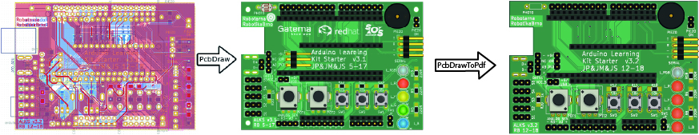

# PcbDrawToPdf

Convert the SVG files generated by [PcbDraw](https://github.com/yaqwsx/PcbDraw) to PDF files.



This tool addresses the challenge of exporting PDF files from PcbDraw, particularly related to the SVG mask property that Inkscape does not convert properly. It processes the SVG file generated by [PcbDraw](https://github.com/yaqwsx/PcbDraw) and produces another SVG file without the masks. The masks are exported as additional groups, allowing for their application in other software, such as Adobe Illustrator.

# Installation

PcbDrawToPdf is a stand-alone CLI tool. PcbDrawToPdf is tested with Inkscape 1.3.2 and PcbDraw v1.1.2.

PcbDrawToPdf is distributed as a Python package. You just have to follow the installation [instructions from PcbDraw](https://github.com/yaqwsx/PcbDraw/blob/v1.1.2/doc/installation.md) and then install PcbDrawToPdf via Pip:

```
pip install PcbDrawToPdf # Use pip or pip3 based on your distribution
```

Now you can test that it works:

```.bash
pcbdrawtopdf --help
```

You should get a help menu.

## Usage

The input for PcbDrawToPdf is the SVG file generated by [PcbDraw](https://github.com/yaqwsx/PcbDraw). This tool provides two main commands:

### Commands

- **`convert-masks`**: This command generates a new SVG file by removing the mask effects and adding the masks as additional groups within the `boardContainer` group. These masks must be applied in Adobe Illustrator from the lowest hierarchy level to the highest. The groups that need masking are renamed with `_<mask-name>`, where `<mask-name>` corresponds to the name of the group containing the mask.
- **`extract-masks`**: This command generates the masks in separate files, which is useful for debugging purposes.

### Mask Application

PcbDraw generates three masks: `hole-mask`, `pads-mask-silkscreen`, and `pads-mask`. The masks should be applied in the following order:

1. `pads-mask-silkscreen`
2. `pads-mask`
3. `hole-mask`

This order is important because `hole-mask` applies to a group at a higher hierarchy level in the SVG file.

## Additional Resources

For more information about applying opacity masks in Adobe Illustrator, please refer to this [video](https://www.youtube.com/live/dgZw71lGOAE?si=zoRidVZViH9u8Fft).

## Examples

```
pcbdrawtopdf convert-masks ArduinoLearningKitStarter.svg ArduinoLearningKitStarter_export.svg
```

```
pcbdrawtopdf extract-masks ArduinoLearningKitStarter.svg export_folder
```